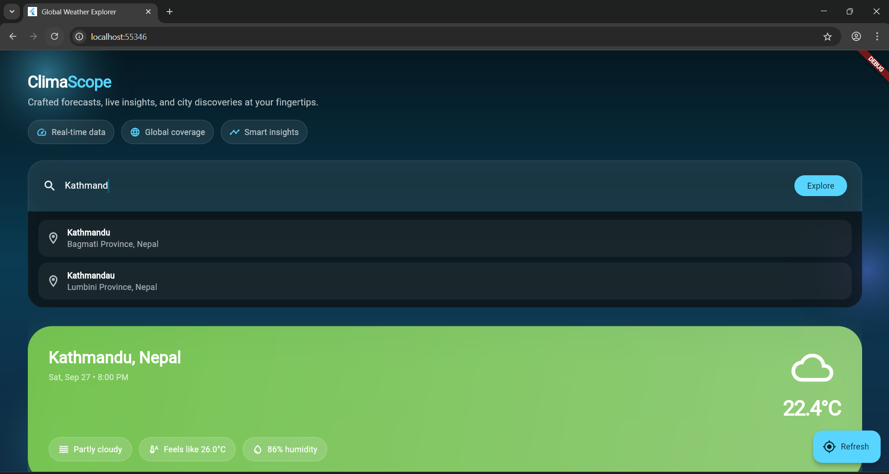

# Global Weather App (Flutter + Provider)

An immersive, production-ready Flutter experience for exploring current weather across the globe. Powered by Provider for state management, the UI blends atmospheric gradients, glassmorphism, and curated micro-interactions to feel like a bespoke weather dashboard crafted by a senior UI/UX designer.

## Highlights

- **Autocomplete city search** powered by Open-Meteo geocoding for instant, multi-location suggestions.
- **Rich weather storytelling** including condition summaries, felt temperature, humidity, and wind insights.
- **Responsive glass UI** with aurora-inspired backgrounds, adaptive layouts, and motion-friendly components.
- **Resilient offline states** with graceful skeleton loaders, inline error banners, and retry flows.

## Architecture Overview

| Layer        | Responsibility                                   | Key Elements                                                                        |
| ------------ | ------------------------------------------------ | ----------------------------------------------------------------------------------- |
| Presentation | Screens & widgets, animations, responsive design | `WeatherScreen`, `WeatherDetails`, `_AuroraBackground`, inline error & empty states |
| State        | Business logic, side-effects, data orchestration | `WeatherProvider` leveraging Provider for reactive updates                          |
| Services     | API clients, data shaping                        | `WeatherService`, `_GeoLocation`, `LocationSuggestion`                              |
| Models       | Typed domain objects                             | `WeatherData`, `LocationSuggestion`, error handling via `WeatherException`          |

State flow relies on `ChangeNotifier` + `Provider` for predictability, with debounced suggestion queries and cached selection data for refresh consistency.

## Packages & Why They Matter

| Package           | Version | Purpose                                                                                   |
| ----------------- | ------- | ----------------------------------------------------------------------------------------- |
| `http`            | ^1.2.1  | Lightweight REST client used to call Open-Meteo geocoding and forecast endpoints.         |
| `provider`        | ^6.1.2  | Simple, battle-tested state management for wiring `WeatherProvider` into the widget tree. |
| `cupertino_icons` | ^1.0.8  | Access to Apple-style iconography; complements Material icons in hybrid designs.          |

All other styling, animation, and layout behavior relies on Flutter's core framework to keep dependencies minimal.

## APIs

- **Forecast**: `https://api.open-meteo.com/v1/forecast`
  - Query params: `latitude`, `longitude`, `current` metrics (temperature, humidity, wind, weather code), `timezone`
- **Geocoding / Autocomplete**: `https://geocoding-api.open-meteo.com/v1/search`
  - Query params: `name`, `count`, `language`, `format`

### Authentication & Limits

Open-Meteo’s endpoints are free and keyless, but rate limits apply—throttle calls with built-in debouncing (`320ms`) and considerate refresh usage.

## Environment

The `.env` file holds any environment-specific configuration (e.g., toggling default city). For production builds, prefer platform-specific secrets management or CI-provided runtime variables.

## Running Locally

```bash
flutter pub get
flutter run -d chrome    # or use the desired device id
```

### Testing

```bash
flutter test
```

Widget tests ship with the project; extend them to cover new states and interactions.

## Design System Notes

- **Color palette**: Deep ocean blues with cyan accents and gradient glows to evoke northern lights.
- **Components**: Glass panels, rounded corner cards, highlight chips, immersive metrics grid.
- **Motion**: Animated suggestion drawer, subtle shadows, and responsive spacing from mobile to wide layouts.

## Screenshots

Add your captures under `docs/screenshots/` and embed them below (example placeholders shown):

| Search & Suggestions                   | Detailed Forecast                          |
| -------------------------------------- | ------------------------------------------ |
|  |  |

Built with Flutter 3.8+ — enjoy exploring the climate palette.
